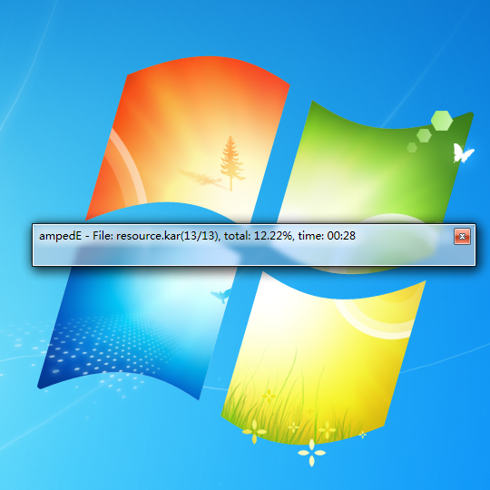

# ampedE
>*Extract KarSource Tool for [Getamped](http://bfo.sdo.com/)*
>
>[更新历史](WHATSNEW.md)
## 界面预览
> 
> 
> 
## 功能介绍
>支持通过修改附带的ini文件，实现批量从预设的kar、dat、repkar、skin、hskin、hhskin中全自动提取文件，可定义多套配置方案灵活切换。
> 
## 性能测试
>在无防护软件监测影响文件读取写入速度的情况下，使用十年前的电脑配置运行Windows7旗舰版操作系统，运行ampedE.exe提取conf文件夹内的系列kar文件及keel.dat、amped.kar、resource.kar（合计1.76GB），源文件无压缩时用时2分36秒，有压缩时用时1分23秒。
>
