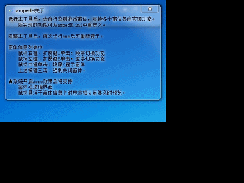
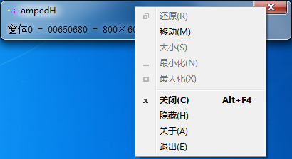
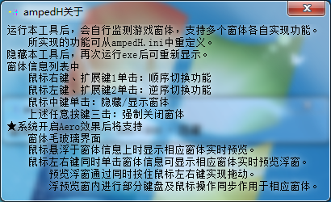
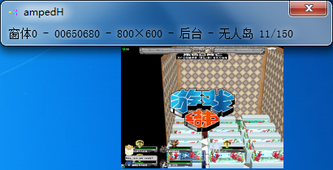

# ampedH
>>*Hung for [Getamped](http://bfo.sdo.com/)*
>
>[更新历史](WHATSNEW.md)
## 说明预览
> 
> 开发者的话（版本1.0.0）
> 
> 
> 
> 界面预览（版本2.0.0）
> 
> 
> 
## 功能介绍
> 
> 启动后自动监测窗体变动
> 
> 支持多个窗体各自实现功能
> 
> 支持从配置文件定义识别的窗体标题、功能脚本等多项参数
> 
> 内置脚本支持全7种分辨率游戏窗体
> 
> ★系统开启Aero效果时
> 
> 　尝试工具窗体毛玻璃效果和鼠标悬浮于窗体信息上时显示相应窗体实时预览
> 
> 　鼠标左右键同时单击窗体信息可显示相应窗体实时预览浮窗
> 
> 　预览浮窗通过同时按住鼠标左右键实现拖动
> 
> 　浮预览窗内进行部分键盘及鼠标操作同步作用于相应窗体
> 
## 操作说明
> 
> 双击exe运行后，界面为条状小型界面，自动监测窗体，所监测窗体的类和标题可从配置文件内重定义，理论支持所有国服和所有外服。
> 
> 
> 
> 界面不在任务上显示，没有最小化按钮，点击关闭按钮后界面隐藏，可从任务栏右侧通知区域的通知图标左键点击开启，
> 
> 界面标题栏和通知图标右键点击可以开启功能菜单，
> 
> 其中菜单中的“隐藏”功能可将界面和通知图标一起隐藏，通过双击exe运行以重新显示，偷偷挂机毫无压力。
> 
> 
> 
> 窗体信息列表中，鼠标右键或扩展键1单击以顺序切换功能，鼠标左键或扩展键2单击以逆序切换功能，鼠标中键单击以隐藏或显示窗体，上述任意按键三击以强制关闭窗体。
> 
> 所实现的功能可从配置文件重定义，自带配置支持游戏全部7种分辨率的无人岛和个人小屋挂机操作。
> 
> ★★★★★★★★★★★★
> 
> 
> 
> 系统开启Aero效果后，将尝试界面毛玻璃效果，以及鼠标悬浮于窗体信息上时显示相应窗体实时预览。
> 
> 窗体信息列表中，鼠标左右键同时单击可显示相应窗体实时预览浮窗，预览浮窗通过同时按住鼠标左右键实现拖动，
> 
> 
> 
> 浮预览窗内进行部分键盘及鼠标操作同步作用于相应窗体。
> 
> 上述同时按住鼠标左右键的操作，可采取按住一键不放再按住另一按键来便捷实现。
> 
## 便捷下载
>
> 版本1.0.0 [ampedH_1.0.0.zip](ampedH_1.0.0.zip)
>
> 版本2.0.0 [ampedH_2.0.0.zip](ampedH_2.0.0.zip)
>
> 版本2.1.0 [ampedH_2.1.0.zip](ampedH_2.1.0.zip)
>
> 版本3.0.0 [ampedH_3.0.0.zip](ampedH_3.0.0.zip)
>
> 版本3.1.0 [ampedH_3.1.0.zip](ampedH_3.1.0.zip)
>
> 版本3.2.0 [ampedH_3.2.0.zip](ampedH_3.2.0.zip)
>
## 贴心提示
>
> exe及ini文件位于bin\Release\文件夹中
