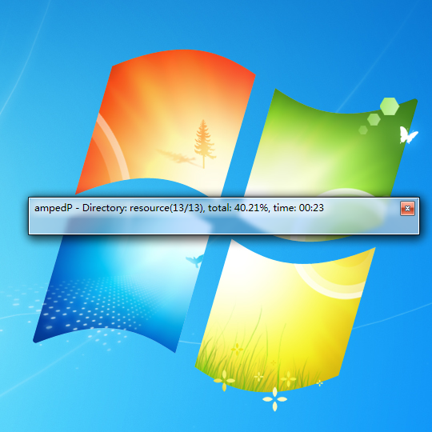

# ampedP
>*Package KarSource Tool for [Getamped](http://bfo.sdo.com/)*
>
>[更新历史](WHATSNEW.md)
## 界面预览
> 
> 
> 
## 功能介绍
>支持通过修改附带的ini文件，实现批量从预设的文件夹中自动识别类型全自动打包为kar、dat、repkar、skin、omd、ssoa文件，可定义多套配置方案灵活切换。
> 
## 性能测试
>在无防护软件监测影响文件读取写入速度的情况下，使用十年前配置的电脑加载Windows7旗舰版操作系统，运行ampedP.exe将已提取的conf文件夹内的系列kar文件及keel.dat、amped.kar、resource.kar（合计约1.76GB，72500个文件）重新打包，无压缩时用时1分02秒，有压缩时用时2分05秒。
>
